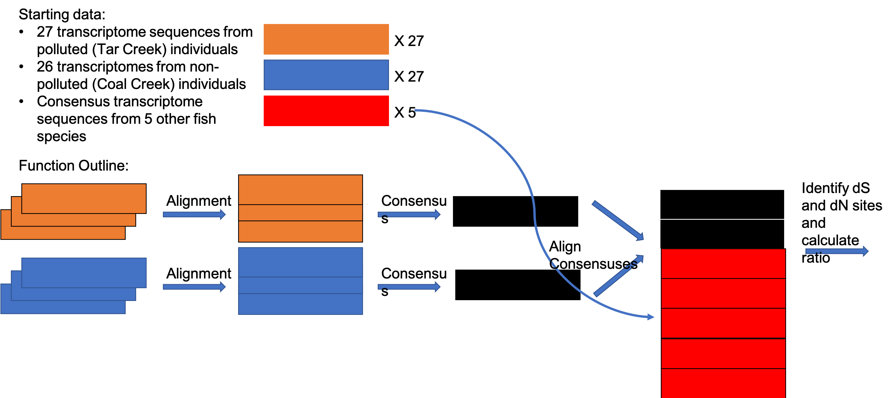

**John Coffin  
2/4/19  
AGRON 935 Semester Project Proposal**  

### Background and Rationale
The Tar Creek Superfund site in Northeastern Oklahoma is heavily contaminated with heavy metals from intensive mining activities. Western mosquitofish (*Gambusia affinis*) have managed to persist in Tar Creek is surprisingly high abundance, but we do not yet know the biological mechanisms surrounding their persistence. In order to understand these mechanisms, I conducted an RNA-sequencing experiment that compared global gene expression between mosquitofish in Tar Creek and a nearby, unpolluted stream, Coal Creek. Now that I have transcriptome sequences with genes that have been identified as differentially expressed between these two sites, a major goal of my future research is to determine whether natural selection is acting on the genes that are differentially expressed, which may be enabling persistence of mosquitofish in Tar Creek. In order to identify signatures of positive selection, I need to estimate the number of nucleotide substitutions that are synonymous (dS: the substitution does not change the amino acid) and nonsynonymous (dN: substitutions that change the amino acid). If the ratio of dN/dS is greater than 1, then the gene has evidence for being under positive selection. The Biopython package (Cock et al., 2009) contains numerous python modules that will enable this analysis, namely the PAML module (Phylogenetic Analysis by Maximum Likelihood; Bio.Phylo.PAML: Talevich et al., 2012), which has several programs (e.g., codeml) that allow for analysis of DNA sequences in a phylogenetic context. For this project, I will generate my own functions and supplement these with already-existing functions available in PAML to identify signatures of natural selection in mosquitofish from Tar Creek.

### Objectives
There are several objectives for this project:  
* download and become familiar with Biopython and the Bio.Phylo.PAML module
* write a python function to compare strings between each transcriptome sequence and generate a consensus sequence
* write a python function to download transcriptome sequences from a publicly-available web resource (GenBank) and align these sequences with my own transcriptomic data
    * this (and subsequent steps) will be done on a subset of the transcriptome data (only use 5 of the transcriptomes from each population, from which I will only take sequences from the top 50 most differentially expressed genes)
* write another python function to import the aligned transcriptome sequences and the phylogenetic tree (which has already been generated) and utilize programs within PAML to estimate dN and dS

### Potential Outcomes
I want my first function to produce two .bam files (a type of DNA alignment file frequently used in bioinformatics), each containing the consensus sequence of the transcriptomes from each site. I want the second function to produce a single .bam file that has all of the transcriptome consensus sequences in it, which will be the input for the PAML Biopython module.

### Sketch
The sketch is available on GitHub: 

### References
Cock, P. et al. 2009. Biopython: freely available Python tools for computational molecular biology and bioinformatics. *Bioinformatics* **25**: 1422-1423.

Talevich, E. et al. 2012. Bio. Phylo: a unified toolkit for processing, analyzing and visualizing phylogenetic trees in Biopython. *BMC bioinformatics* **13**: 201.
